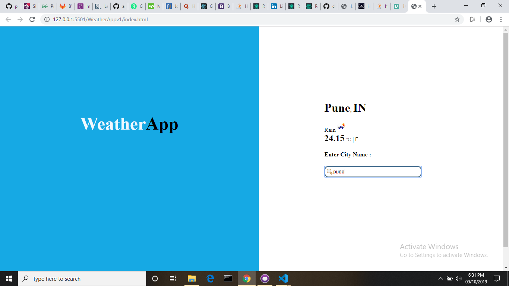

# weatherAppV2
 Welcome to Weather Application! I build this application to learn how to use online api in application and get real-time data. I hope you will get real time weather of your specified location. 
using HTML,CSS,javaScript,jquery,Bootstrap.
## Technology Used:
HTML,CSS,JavaScript,Bootstrap
## Image:

#### ++++++++++++++++++++++++++++++++++++++++++++++++++++++++++++++++++++++

#### ++++++++++++++++++++++++++++++++++++++++++++++++++++++++++++++++++++++
### You can access it here (use Google Chrome!):
https://patils-dev.github.io/WeatherAppv1/
