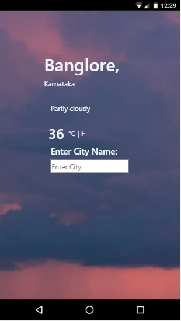

# weather Application
 Welcome to Weather Application! This application will give you real time weather of of specified city. Also you can see temperature in degree and in farenheit. I build this application to learn how to use online api in application and get real-time data. I hope you will get real time weather of your specified location.
## Technology Used:
HTML, CSS, JavaScript(ES6), Bootstrap.
## Image:

#### You can access it here (use Google Chrome!):
 https://smita-dev.github.io/WeatherAppWithAPI/
